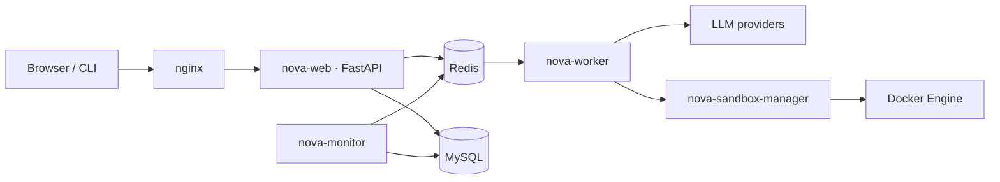

<div align="center">


<h1>Nova</h1>

**An intelligent copilot for NLP teaching and learning.**

*Start from a single question — ask, understand, practice, and review, all in one place.*

<p>
  
  
  
  
  
</p>

<p>
  <a href="#features">✨ Features</a> ·
  <a href="#architecture">🏗️ Architecture</a> ·
  <a href="#quick-start">🚀 Quick Start</a> ·
  <a href="README.zh.md">中文</a> ·
  <a href="CONTRIBUTING.md">Contributing</a> ·
  <a href="LICENSE">License</a>
</p>

</div>


Nova is not another general-purpose chatbot. It is a **teaching-and-learning copilot for NLP classrooms**: teachers author topics, knowledge points and auto-graded exercises; learners ask questions and are led through Socratic explanations, practice and review — while every attempt is scored against a rubric the teacher defined.

## Four dedicated views

Nova ships as **four role-based views** over a single deployment, so a whole classroom runs on one instance:

| Learner | Teacher |
| :---: | :---: |
| Ask, understand, practice, review | Author courses, knowledge points & analytics |
|  |  |

| Developer | Monitor |
| :---: | :---: |
| Platform, models & configuration | Traces, metrics & worker activity |
|  |  |

## ✨ Features

- 🎓 **Four views for one classroom** — Learner, Teacher, Developer and Monitor interfaces, gated by role-based access control.
- 🧭 **Socratic guided learning** — guided sessions carry a learner from a misconception to understanding, one step at a time.
- 📝 **Auto-graded exercises** — teacher-defined blueprints generate fill-in, multiple-choice, table, formula, code and coordinate-graph questions, then grade every attempt against weighted rubrics.
- 🧠 **Knowledge-point catalogue** — teachers author topics and Markdown knowledge points; Nova injects exactly the right scope into each prompt, never silently truncating it.
- 🚦 **Built-in observability** — a dedicated monitor surfaces turns, traces and metrics across web, worker and sandbox.
- 🔌 **Modular runtime** — a coordinator/worker engine built on LangGraph, with tool runtime, memory runtime and sandboxed code execution.
- 💬 **Web and CLI** — chat from the browser or straight from the terminal.

## 🏗️ Architecture



The web process owns a single, lifecycle-owning **Backend Gateway** (coordinator, worker, LangGraph, tool, memory and persistence lifecycles). Turns are dispatched to `nova-worker` over Redis; generated code runs inside an isolated `nova-sandbox-manager` container; and `nova-monitor` observes the whole pipeline.

## 🚀 Quick Start

### Prerequisites

- Python 3.11 or newer, and [uv](https://docs.astral.sh/uv/).
- A MySQL database, configured in `.env`.

A full distributed stack (nginx, MySQL, Redis, web, worker, sandbox manager) is provided in [`compose.yaml`](./compose.yaml).

### Install and run

```powershell
uv sync                                   # install dependencies
Copy-Item .env-example .env               # prepare config: model key & database
uv run python main.py bootstrap-db        # initialize the database
uv run python main.py bootstrap-developer # create the first account
uv run python main.py serve               # start the server
```

Once it starts, open <http://127.0.0.1:8765>.

### Log in and explore

Log in with the account created by `bootstrap-developer`:

- Learner — <http://127.0.0.1:8765/>
- Teacher — <http://127.0.0.1:8765/teacher>
- Developer — <http://127.0.0.1:8765/developer>

Or chat from the terminal:

```powershell
uv run python main.py chat
```

For the observability monitor, run `uv run python main.py monitor` first, then open <http://127.0.0.1:8766/>.

## 📚 Documentation

- [Contributing](./CONTRIBUTING.md)
- [Configuration & guides](./docs/)
- [License](./LICENSE)

---

This repository is licensed under the [MIT](./LICENSE) license.