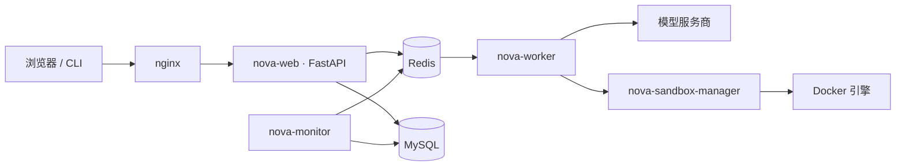

<div align="center">


<h1>Nova</h1>

**面向 NLP 课堂的教学与学习助手。**

<p>
  
  
  
  
  
  
  
  
  
  
</p>

<p>
  <a href="#功能">功能</a> ·
  <a href="#架构">架构</a> ·
  <a href="#快速开始">快速开始</a> ·
  <a href="README.md">English</a> ·
  <a href="CONTRIBUTING.zh.md">贡献指南</a> ·
  <a href="LICENSE">许可证</a>
</p>

</div>


Nova 是面向 NLP 教学与学习的助手。教师编写主题、知识点与练习；学生提问后获得讲解、练习与复盘。每次练习作答都按教师定义的评分细则打分。

## 从这里开始

| 你想... | 去看 |
| --- | --- |
| 几分钟内本地跑起来 | [快速开始](#快速开始) |
| 看看长什么样 | [四个端](#四个端) |
| 了解功能 | [功能](#功能) |
| 了解架构 | [架构](#架构) |
| 配置模型与数据库 | [`.env-example`](./.env-example) |
| 参与贡献或扩展 | [CONTRIBUTING.zh.md](./CONTRIBUTING.zh.md) |

## 四个端

Nova 在一个部署上运行四个基于角色的视图，整个课堂只需一套实例：

| 学习者 | 教师 |
| :---: | :---: |
| 提问、理解、练习、复盘 | 编写课程、知识点与分析 |
|  |  |

| 开发者 | 运行监控 |
| :---: | :---: |
| 平台、模型与配置 | 追踪、指标与任务活动 |
|  |  |

## 功能

- **四个基于角色的视图**：学习者、教师、开发者、运行监控，由访问控制隔离。
- **引导式学习**：问答式会话，一步一步推进。
- **自动批改练习**：教师定义蓝图，生成题目并按加权评分细则打分。
- **知识点目录**：教师编写主题与 Markdown 知识点，每次提问注入恰好对应的范围。
- **可观测性**：内建监控纵览 web、worker 与 sandbox 的轮次、追踪与指标。
- **模块化运行时**：基于 LangGraph 的协调者 / 工作者引擎，含工具、记忆与隔离代码执行。
- **网页与命令行**：可在浏览器或终端对话。

## 架构



Web 进程运行唯一的 Backend Gateway，统管协调者、工作者、LangGraph、工具、记忆与持久化。任务经 Redis 派给 `nova-worker`；生成的代码在隔离的 `nova-sandbox-manager` 容器中运行；`nova-monitor` 观测整条流水线。

## 快速开始

### 环境要求

- Python 3.11 或更高版本，以及 [uv](https://docs.astral.sh/uv/)。
- 一个 MySQL 数据库，连接信息在 `.env` 中配置。

> [!NOTE]
> 先把 [`.env-example`](./.env-example) 复制为 `.env`，填好模型服务密钥与数据库连接再启动。

> [!TIP]
> 完整分布式栈（nginx、MySQL、Redis、web、worker、sandbox manager）见 [`compose.yaml`](./compose.yaml)。

### 安装与运行

```powershell
uv sync                                   # 安装依赖
Copy-Item .env-example .env               # 准备配置，填写模型服务密钥与数据库连接
uv run python main.py bootstrap-db        # 初始化数据库
uv run python main.py bootstrap-developer # 创建第一个账号
uv run python main.py serve               # 启动服务
```

启动成功后，在浏览器打开 <http://127.0.0.1:8765>。

### 登录与使用

用 `bootstrap-developer` 创建的账号登录后即可开始：

- 学习者 —— <http://127.0.0.1:8765/>
- 教师 —— <http://127.0.0.1:8765/teacher>
- 开发者 —— <http://127.0.0.1:8765/developer>

也可以直接在命令行里对话：

```powershell
uv run python main.py chat
```

需要运行监控时，先执行 `uv run python main.py monitor`，再打开 <http://127.0.0.1:8766/>。

## 文档

- [贡献指南](./CONTRIBUTING.zh.md)
- [配置与指南](./docs/)
- [许可证](./LICENSE)

---

本仓库采用 [MIT](./LICENSE) 许可证开源。