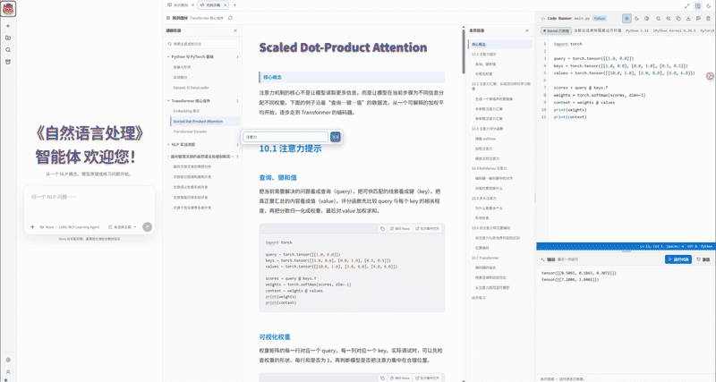
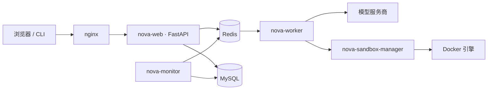

<div align="center">


<h1>Nova</h1>

**面向 NLP 教学与学习的智能助手。**

*从一个问题开始 —— 提问、理解、练习、复盘，一站式完成。*

<p>
  
  
  
  
  
  
  
</p>

<p>
  <a href="#功能">功能</a> ·
  <a href="#架构">架构</a> ·
  <a href="#快速开始">快速开始</a> ·
  <a href="README.md">English</a> ·
  <a href="CONTRIBUTING.zh.md">贡献指南</a> ·
  <a href="LICENSE">许可证</a>
</p>

</div>



Nova 不是又一个通用聊天机器人，而是一个面向 **NLP 课堂的教学与学习协作者**：教师编写主题、知识点与自动批改练习；学习者提出问题，在苏格拉底式讲解、练习与复盘中被一步步引导——每一次作答都由教师定义的评分细则来打分。

## 四个端

Nova 在一个部署上提供 **四个基于角色的视图**，整个课堂只需一套实例即可运转：

| 学习者 | 教师 |
| :---: | :---: |
| 提问、理解、练习、复盘 | 编写课程、知识点与分析 |
|  |  |

| 开发者 | 运行监控 |
| :---: | :---: |
| 平台、模型与配置 | 追踪、指标与任务活动 |
|  |  |

## 功能

- **一套课堂，四个端** —— 学习者、教师、开发者、运行监控，由基于角色的访问控制隔离。
- **苏格拉底式引导学习** —— 引导式会话一步步带着学习者从误区走向理解。
- **自动批改练习** —— 教师定义的蓝图自动生成填空、单选、表格、公式、代码与坐标图题目，并依据加权评分细则为每次作答打分。
- **知识点目录** —— 教师编写主题与 Markdown 知识点；Nova 为每次提问注入恰好对应的教学范围，绝不静默截断。
- **内建可观测性** —— 独立的监控视图贯通 web、worker 与 sandbox 的轮次、追踪与指标。
- **模块化运行时** —— 基于 LangGraph 的协调者 / 工作者引擎，含工具运行时、记忆运行时与隔离代码执行。
- **网页与命令行** —— 既可在浏览器对话，也可直接在终端对话。

## 架构



Web 进程持有一个唯一的、管理生命周期的 **Backend Gateway**（协调者、工作者、LangGraph、工具、记忆与持久化的生命周期）。任务通过 Redis 派发给 `nova-worker`；生成的代码在隔离的 `nova-sandbox-manager` 容器中运行；`nova-monitor` 观测整条流水线。

## 快速开始

### 环境要求

- Python 3.11 或更高版本，以及 [uv](https://docs.astral.sh/uv/)。
- 一个 MySQL 数据库，连接信息在 `.env` 中配置。

完整分布式栈（nginx、MySQL、Redis、web、worker、sandbox manager）见 [`compose.yaml`](./compose.yaml)。

### 安装与运行

```powershell
uv sync                                   # 安装依赖
Copy-Item .env-example .env               # 准备配置，填写模型服务密钥与数据库连接
uv run python main.py bootstrap-db        # 初始化数据库
uv run python main.py bootstrap-developer # 创建第一个账号
uv run python main.py serve               # 启动服务
```

启动成功后，在浏览器打开 <http://127.0.0.1:8765>。

### 登录与使用

用 `bootstrap-developer` 创建的账号登录后即可开始：

- 学习者 —— <http://127.0.0.1:8765/>
- 教师 —— <http://127.0.0.1:8765/teacher>
- 开发者 —— <http://127.0.0.1:8765/developer>

也可以直接在命令行里对话：

```powershell
uv run python main.py chat
```

需要运行监控时，先执行 `uv run python main.py monitor`，再打开 <http://127.0.0.1:8766/>。

## 文档

- [贡献指南](./CONTRIBUTING.zh.md)
- [配置与指南](./docs/)
- [许可证](./LICENSE)

---

本仓库采用 [MIT](./LICENSE) 许可证开源。